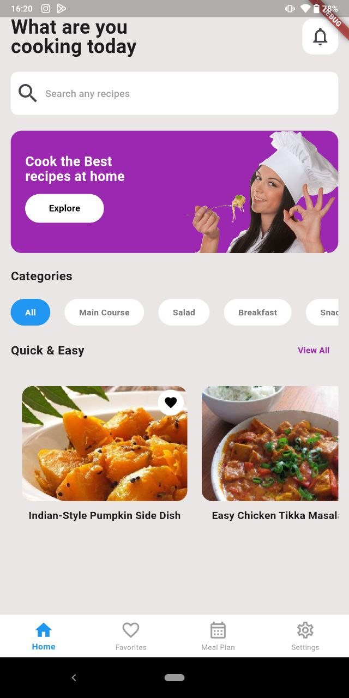
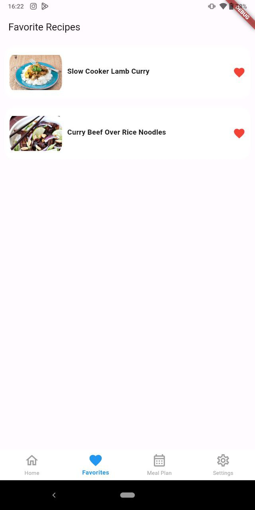
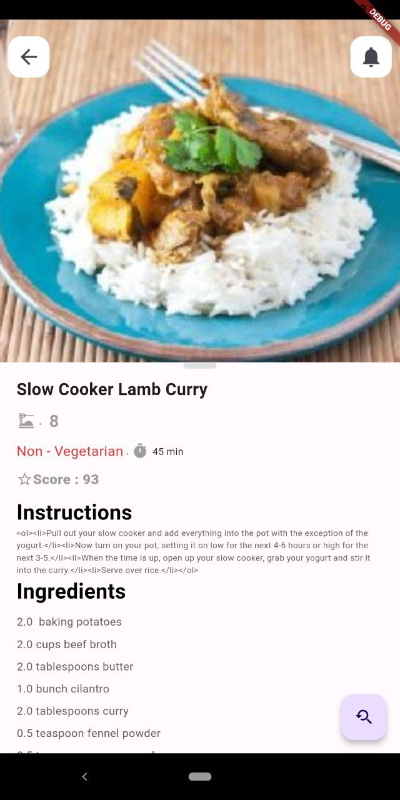

# Foody Guy

Foody Guy is a Flutter app that helps users explore recipes from different cuisines. The app allows users to search recipes, view details, and store their favorite recipes locally using Hive. It fetches data from the Spoonacular API and supports a variety of cuisine types, such as "All", "Main Course", "Salad", "Breakfast", "Snack", "Drink", etc.

## Features

- Browse recipes from various cuisines.
- Filter recipes by type (e.g., Main Course, Salad, Breakfast, etc.).
- View recipe details, including ingredients and instructions.
- Save favorite recipes to local storage using Hive.
- Fetch recipes from Spoonacular API.
- - On the Recipe Details Page, there is a button that redirects users to YouTube search results for that recipe, allowing them to find relevant cooking videos.

## Screenshots


- **Home Page**: Displays a list of recipes based on the selected filter.  
  

- **Favourite Page**: Shows the list of favorite recipes stored in local storage.  
  

- **Recipe Details Page**: Provides detailed information about a specific recipe.  
  

## Setup

### Prerequisites

- [Flutter](https://flutter.dev/docs/get-started/install) installed on your machine.
- An active internet connection to fetch recipes from the Spoonacular API.

### Installation

1. Clone the repository:
   ```bash
   git clone https://github.com/akashpd390/Foody-Guy.git
   ```

2. Navigate to the project directory:
   ```bash
   cd Foody-Guy
   ```

3. Install the dependencies:
   ```bash
   flutter pub get
   ```

4. Run the app:
   ```bash
   flutter run
   ```

## Dependencies

The app uses the following dependencies:

- `http`: ^1.2.2 - To make HTTP requests to fetch recipes from the Spoonacular API.
- `flutter_dotenv`: ^5.2.1 - For loading environment variables (like API keys).
- `hive`: ^2.0.5 - A lightweight local storage solution for storing favorite recipes.
- `hive_flutter`: ^1.1.0 - Integrates Hive with Flutter.
- `provider`: ^6.1.2 - State management for the app.
- `url_launcher`: ^6.0.9 - To open external URLs (e.g., Yotube source).

### Spoonacular API Key

1. Sign up for an API key at [Spoonacular API](https://spoonacular.com/food-api).
2. Create a `.env` file at the root of the project and add your API key:
   ```
   SPOONACULAR_API_KEY=your_api_key_here
   ```

### File Structure

The `lib` directory structure is organized as follows:

```
lib/
│
├── components/         # UI components and widgets
├── models/             # Data models for recipes
├── pages/              # Pages like Home, Favorites, Recipe Details
└── provider/           # State management using Provider
```

### Usage

- **Home Page**: On the home page, users can browse recipes. They can filter the recipes by selecting a cuisine type (e.g., All, Main Course, Salad, etc.).
- **Favorite Page**: Users can save their favorite recipes. The saved recipes are stored in local storage using Hive and can be accessed from this page.
- **Recipe Details Page**: Clicking on a recipe will open the details, showing more information about the ingredients and preparation steps.

## Local Storage with Hive

This app uses **Hive** for storing favorite recipes locally. The data is stored in a lightweight and efficient way, allowing users to keep their favorite recipes even when they are offline.

## Contributing

Feel free to fork the repository, make changes, and create pull requests if you would like to contribute.
